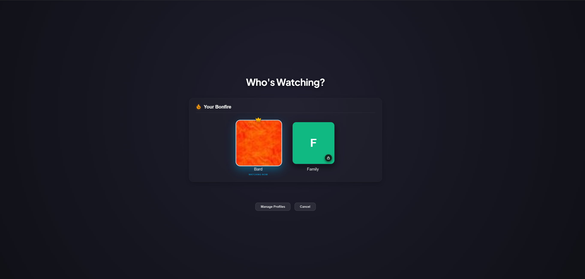
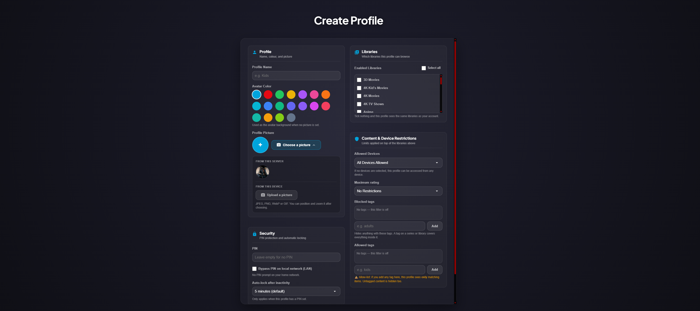

# Bonfire/JellyProfiles

Adds multi-user profile switching to Jellyfin. A single account can have up to five isolated profiles — each with its own watch history, parental controls, and library access.

> Built for Jellyfin Server **10.11.x** (all minor versions supported).

---

## Screenshots



*Shown when the app opens, and whenever you switch.*



*Creating a profile: libraries, PIN, device limits and tag filters in one place.*

---

## Installation

1. In your Jellyfin dashboard, go to **Plugins → Repositories → ＋**
2. Paste the following URL and click **Save**:
   ```
   https://ahouseofbards.github.io/Bonfire-JellyProfiles/manifest.json
   ```
3. Go to **Plugins → Catalog**, find **Bonfire/JellyProfiles**, and click **Install**
4. Restart your Jellyfin server when prompted

Once the server restarts, the plugin is active and will automatically load on all compatible clients with no further setup.

### Beta channel

The repository above lists **milestone releases only** — the builds meant for everyday use. Pre-release builds and older point releases live in a separate repository:

```
https://raw.githubusercontent.com/AHouseOfBards/Bonfire-JellyProfiles/beta/manifest.json
```

Add it **alongside** the stable one, not instead of it. The two lists do not overlap — every version appears in exactly one of them — so the beta repository on its own would never offer you a stable release. Both describe the same plugin, so Jellyfin merges them into one version list. Remove the beta repository to go back to milestones only. See [BETA-CHANNEL.md](https://github.com/AHouseOfBards/Bonfire-JellyProfiles/blob/beta/BETA-CHANNEL.md).

> [!WARNING]
> **Beta builds are unfinished and features in them may be broken.** They exist so new work can be tested before it reaches everyone, which means:
>
> * A feature may not work at all, may work differently from its description, or may disappear in the next build.
> * Settings introduced in a beta can change shape before release. Reverting to a stable build afterwards may leave those settings behind or reset them.
> * The profile switcher itself can break. If that happens the plugin can make the Jellyfin web interface hard to use — see the **Emergency disable code** under *Known Limitations* before you rely on a beta on a machine you need working.
>
> Please do report what you find on [GitHub Issues](https://github.com/AHouseOfBards/Bonfire-JellyProfiles/issues) — that is what the channel is for. Just don't put a beta on a server your household depends on that evening.

> [!NOTE]
> **How the client script reaches your browser**
>
> Bonfire adds a small script to the Jellyfin web page. Since 1.5 it does that **as the page is served**, leaving `index.html` on disk alone. Nothing to re-apply after a Jellyfin update, and no file permissions to grant. Editing `index.html` is still available as a legacy option.
>
> If it is ever not working, the plugin configuration page (**Dashboard → Plugins → Bonfire**) says so under **Advanced → Client script**, along with how many pages it has served.

<details>
<summary><b>Legacy: editing <code>index.html</code></b></summary>

Under **Advanced → Client script** on the plugin configuration page:

| Method | What it does |
| --- | --- |
| **Serve it live, never touch index.html** | The default. Any tags an earlier version wrote are taken back out. |
| **Patch index.html, fall back to serving it live** *(legacy)* | For a setup that needs the tag physically in the file, such as a proxy that caches the page. |
| **Patch index.html only** *(legacy)* | What every release up to 1.4 did. No fallback. |

Both legacy modes need Jellyfin to be able to write to its own web files, which it often cannot on Docker, on Linux packages, or in a protected Windows directory. If that write fails the configuration page prints the exact command for your host — but unless you have deliberately picked one of these modes, there is no reason to grant that access.

</details>

---

## Features

- Up to five profiles per Jellyfin account, each with its own watch history, library access and parental rating.
- **Tag filters.** Block or allow content per profile using Jellyfin's own tags (`adults`, `kids`, and so on). Tags are inherited, so tagging a series or a whole library covers everything inside it. Jellyfin enforces this server-side, so it holds on every client — including the ones that cannot show the switcher.
- **PINs.** Optional per profile, stored as salted PBKDF2-SHA256 hashes, with an optional bypass on your own network.
- **Device limits.** Restrict a profile to particular devices.
- **Your Bonfire.** Link accounts with a 6-character code so two households share one switcher screen.
- **Avatar library.** Upload a set of pictures everyone on the server can pick from, and optionally require them. On a TV this is the only practical way to set a picture, since there is no file browser.
- **Switcher style.** Each account picks the full-screen "Who's Watching?" gate or a **Switch Profile** entry in Jellyfin's own menu, under **Settings → Switcher Style**. It is a per-household choice, not a server setting.

---

## Library Artwork

Jellyfin builds a library tile from the items inside it, and that query does not know who
is looking. So a Kids profile can end up with a Movies tile showing a poster from a film it
cannot open.

Give a profile its own picture for a library, or no artwork at all, under **Edit profile
→ Library Artwork**. With no artwork the tile falls back to its icon and name. Libraries
left alone keep Jellyfin's own.

Two limits. The swap happens in the browser, so the picture is never shown but jellyfin-web
still downloads the original. And it only applies where Bonfire runs — a client that cannot
load the plugin script shows Jellyfin's artwork as usual.

---

## Client Compatibility

Bonfire works by injecting a script into the web client your server hands out. So the dividing line is not the operating system — it is whether the app loads Jellyfin's web client **from your server** or ships its own copy.

**Works:**
- Jellyfin Web (desktop & mobile browsers)
- Official Jellyfin Android app — a wrapper around your server's web client
- Jellyfin Media Player (Windows, macOS, Linux)
- **LG webOS** — the app loads your server's web client into a frame, so the switcher comes with it

**Works, with a caveat:**
- **Samsung Tizen** — the Tizen app builds its own copy of the web client into the `.wgt` package rather than fetching yours, so the plugin cannot inject itself at runtime. Users have reported the switcher working anyway, with Bonfire bundled into the package at build time. It works, but the package has to be rebuilt to pick up plugin updates — nothing reaches it automatically.

**Cannot work:**
- Jellyfin for Android TV / Google TV — a native app, not a web client
- Swiftfin (iOS / tvOS), Findroid, Jellyfin for Roku, Infuse — likewise native

> [!IMPORTANT]
> **Parental controls still apply on every client, including the ones above.** Library access, maximum parental rating and tag filters are stored on the Jellyfin user account and enforced by the *server*. A sub-profile signed in on Android TV sees exactly what it is allowed to see. What those clients cannot show is the switcher itself — you sign in as the sub-profile directly instead.

---

## Bonfire Sharing & Security

Sharing a Bonfire code lets another household see your switcher screen — and switching into an account gives the person a real, fully privileged session for it. Two rules protect that boundary:

* **An account with no PIN cannot be opened from a shared Bonfire.** If you want other members to be able to switch into your main account, set a profile PIN on it first. Sub-profiles are unaffected — they work with or without a PIN.
* **The LAN bypass never applies across accounts.** Being on the same network as someone in your Bonfire does not skip their PIN; it only skips your own.

> [!TIP]
> A Bonfire code is a credential. Anyone who has it can join, and you can only be in one Bonfire at a time — joining a new one removes you from your current one.

### Sharing a TV with another adult

Both rules are strict by design, and for two adults who share a living room they are strict in the wrong direction: typing a PIN with a TV remote every time you swap accounts is miserable.

So each account can lift them **for itself**. In **Settings → Your Bonfire** on the switcher screen, tick *"Let my Bonfire switch into my account on this network"*. People in your Bonfire can then enter your account from your home network without your PIN — including when you have no PIN at all. Away from home nothing changes: the PIN is still required, and an account with no PIN still cannot be opened remotely.

It is off by default, only you can turn it on for your own account, and every switch that uses it is written to the profile activity log.

> [!WARNING]
> Two things to check first. If your account is a **Jellyfin administrator**, anyone who switches into it can change server settings and manage every user on it — only enable this if you would hand them the password. And "your home network" is whatever your *server* counts as local: if it sits behind a reverse proxy that is not listed under **Dashboard → Networking → Known Proxies**, every visitor looks local, and this setting would apply to all of them.

---

## Known Limitations

**Skin Manager / custom themes**  
The Switch Profile button is designed to align with standard Jellyfin layouts. If you use custom themes or a skin manager, the button might occasionally appear misaligned or out of place. Switching to the **Jellyfin menu** style under *Settings → Switcher Style* removes the injected button entirely and puts the switcher on your profile page instead, which sidesteps theme conflicts. Either way, please open an issue with the name of the theme you are using.

**Profile creation is on the home screen, not the admin dashboard**  
Profiles are created and managed via the Switch Profile button on the Jellyfin home screen. The admin dashboard page (**Dashboard → Plugins → Bonfire**) is for server-wide settings (maximum profile count, require-PIN policy), the avatar library, administrator PIN resets, and the emergency disable code.

**Emergency disable code**  
If Bonfire breaks badly it can make the Jellyfin web interface hard to use — including the settings page you would need to uninstall it. Administrators can set a code under **Dashboard → Plugins → Bonfire → Advanced → Emergency Disable Code**. Entering it on any Bonfire screen, or pressing `Ctrl+Shift+B`, shuts the plugin's client script off **until Jellyfin restarts**.

It is off by default, and worth understanding before you turn it on:

* It does **not** unlock other profiles — switching still requires that profile's PIN — and it does not widen library access, parental ratings or tag filters, which Jellyfin enforces server-side regardless of this plugin.
* It **does** skip the profile gate. On a device already signed in to the master account, anyone who knows the code gets that account's full library without being asked to choose a profile.
* It is submitted without a password, so make it long. Attempts are capped at five per hour per address, and every use is logged.
* It cannot rescue every failure. If the plugin's script fails to load at all, the code has nothing to run in — restart Jellyfin, or delete the plugin folder, for that case.

---

## For Developers

Building a native app or custom Jellyfin client?

📄 **[Developer API Reference](docs/developer-api.md)**

All 41 endpoints with their request and response schemas, the seven routes that work without a token and why each one has to, profile switching and PIN verification, the Bonfire sharing rules, and how to add a translation.

For which clients the switcher can appear on at all, see [Client Compatibility](#client-compatibility) above — the plugin injects a script into your server's web client, so that is a question about the app, not about the API.

---

## License

MIT — see [LICENSE](LICENSE)
