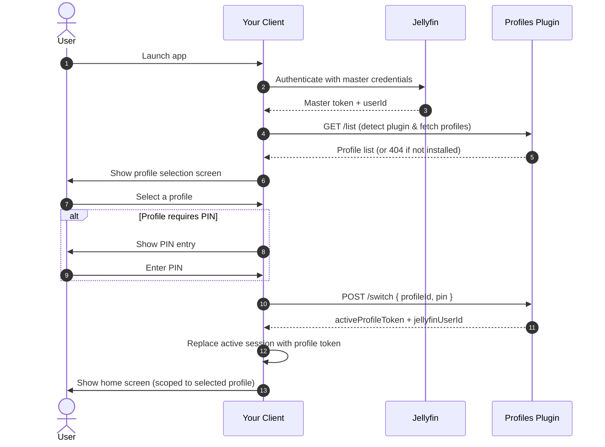

# Jellyfin Profiles Plugin — Developer API Reference

**Plugin GUID:** `b1462fca-774b-4b13-8d02-e2d4f2bc18b9`
**Compatible with:** Jellyfin Server 10.11.x
**Base path:** All endpoints are relative to your Jellyfin server root:
```
https://<server>/plugins/profiles/<endpoint>
```

---

## Overview

The Profiles Plugin adds Netflix-style profile switching to Jellyfin. It works by creating isolated Jellyfin user accounts (sub-profiles) under a primary master account. When a profile is selected, the plugin issues a scoped session token for that profile, which the client uses for all subsequent API calls — giving it fully isolated watch history, parental limits, and library access without requiring a separate Jellyfin login.

As a third-party client, your responsibility is to:
1. Detect that the plugin is active and fetch the profile list on login.
2. Display a profile selection screen before showing the home view.
3. Swap your active session token after the user selects a profile.
4. Provide a way to return to the profile selector at any time.

---

## Authentication

Every request to the plugin API must include a standard Jellyfin authorization header. Use the **Master User's token** for all profile management calls. After a successful profile switch, use the **returned profile token** for all subsequent Jellyfin API calls.

```
Authorization: MediaBrowser Client="<AppName>", Device="<DeviceName>", DeviceId="<UniqueId>", Version="<AppVersion>", Token="<token>"
```

Both `Authorization` and `X-Emby-Authorization` header names are accepted.

---

## Plugin Detection

Before using any plugin endpoints, verify the plugin is installed on the server by calling `GET /list`. If the plugin is not installed, Jellyfin will return `404 Not Found` for that route (since the route simply does not exist). If it returns `200 OK` or `401 Unauthorized`, the plugin is active.

**Recommended check on app launch:**
```
GET /plugins/profiles/list
```
- `200` or `401` → Plugin is installed, proceed with profile flow.
- `404` → Plugin is not installed. Skip the profile gate and log in normally.

---

## Error Responses

All error responses return a plain-text string body describing the reason. Do not attempt to parse them as JSON.

| Status | Typical meaning |
|---|---|
| `400 Bad Request` | Missing or invalid field in the request body |
| `401 Unauthorized` | Missing/invalid token, incorrect PIN, or insufficient permission |
| `404 Not Found` | The referenced `profileId` does not exist |

Example `401` body:
```
Invalid PIN code.
```

---

## Endpoints

### `GET /plugins/profiles/list`

Returns all profiles available to the authenticated user, including the master profile and all sub-profiles.

**Authorization:** Master User token or any active sub-profile token (always returns profiles scoped to the same master account).

**Response `200 OK`:**
```json
[
  {
    "profileUserId": "8e3cdfa5-79a8-4bb9-bd9a-0e96b7dc974a",
    "profileName": "John",
    "avatarInitial": "J",
    "avatarColor": "#00A4DC",
    "requiresPin": true,
    "isMaster": true
  },
  {
    "profileUserId": "a90f11cb-42a1-432d-94bb-97cc2d42ef8b",
    "profileName": "Kids",
    "avatarInitial": "K",
    "avatarColor": "#EC4899",
    "requiresPin": false,
    "isMaster": false
  }
]
```

| Field | Type | Description |
|---|---|---|
| `profileUserId` | `string (GUID)` | Jellyfin user ID for this profile |
| `profileName` | `string` | Display name |
| `avatarInitial` | `string` | First character of the profile name, uppercased |
| `avatarColor` | `string` | Hex color string for the avatar background |
| `requiresPin` | `boolean` | Whether a PIN is required to select this profile |
| `isMaster` | `boolean` | Whether this entry is the master account |

---

### `POST /plugins/profiles/switch`

Authenticates a profile selection and returns a scoped session token. This token must replace your client's active session immediately.

To **switch back to the master profile**, pass the master account's `profileUserId` as the `profileId`. The master user's PIN (if set) will be required.

**Authorization:** Master User token or any active sub-profile token

**Request body:**
```json
{
  "profileId": "a90f11cb-42a1-432d-94bb-97cc2d42ef8b",
  "pin": "1234"
}
```

| Field | Type | Required | Description |
|---|---|---|---|
| `profileId` | `string (GUID)` | Yes | The `profileUserId` of the profile to switch to |
| `pin` | `string` | Conditional | Required only if `requiresPin` is `true` for this profile |

**Response `200 OK`:**
```json
{
  "activeProfileToken": "7ef4a378297b470183b0b3e6cda7670e",
  "jellyfinUserId": "a90f11cb-42a1-432d-94bb-97cc2d42ef8b"
}
```

> [!IMPORTANT]
> Replace your client's active token and user ID with these values immediately. All subsequent Jellyfin API calls — library browsing, playback, progress reporting — must use `activeProfileToken` and `jellyfinUserId`. Store the original Master token separately so the user can switch profiles again later.

**Error responses:**

| Status | Meaning |
|---|---|
| `401 Unauthorized` | PIN was incorrect, or caller is not authorized to switch to this profile |
| `404 Not Found` | The specified `profileId` does not exist |

---

### `POST /plugins/profiles/verify-pin`

Validates a PIN for a given profile without performing a switch. Use this to pre-validate a PIN before showing a confirmation UI, or before profile management operations.

**Authorization:** Master User token or any active sub-profile token

**Request body:**
```json
{
  "profileId": "a90f11cb-42a1-432d-94bb-97cc2d42ef8b",
  "pin": "1234"
}
```

**Response:** `200 OK` if the PIN is correct, `401 Unauthorized` if incorrect.

---

### `GET /plugins/profiles/libraries`

Returns the list of media libraries visible to the authenticated user. Use this to populate a library access selector when creating or editing profiles.

**Authorization:** Master User token

**Response `200 OK`:**
```json
[
  {
    "id": "e67b2d5a39cb400ba45a7b0a70198de7",
    "name": "Movies",
    "collectionType": "movies"
  },
  {
    "id": "c19b2e7a25ff402da18b2b6c90197ee4",
    "name": "TV Shows",
    "collectionType": "tvshows"
  }
]
```

---

## Integration Guide

### Session Lifecycle



### Storage Requirements

Your client must maintain two separate credential stores:

| Store | Contents | Lifetime |
|---|---|---|
| **Master credentials** | Master `userId` + Master `token` | Cleared on logout |
| **Active profile token** | `activeProfileToken` + profile `userId` | Cleared when returning to profile selector |

On app launch, if a master token is stored but no active profile token exists, show the profile selection screen before any home content.

### Returning to the Profile Selector

To allow users to switch profiles from within the app (e.g., via a button in the navigation bar):

1. Restore the **Master token** as the active session token in your API client.
2. Clear the stored active profile token.
3. Navigate back to the profile selection screen.
4. Call `GET /list` again to refresh the profile list before display.

### PIN Error Handling

When `POST /switch` returns `401` on a PIN-protected profile, the user entered an incorrect PIN. The recommended UX is to:
- Clear the PIN input field.
- Display an inline error message (do not use a modal alert).
- Keep the PIN screen open so the user can try again.

---

## Profile Management (Master Account Only)

The following endpoints are only callable by the **master account**. Requests made with a sub-profile token will receive `401 Unauthorized`.

### `POST /plugins/profiles/create`

Creates a new sub-profile under the master account. The server enforces a maximum of 5 sub-profiles per master account by default (configurable by the server administrator).

**Request body:**
```json
{
  "profileName": "Kids",
  "pin": "4321",
  "avatarColor": "#EC4899",
  "maxParentalRating": "6",
  "enabledFolders": ["e67b2d5a39cb400ba45a7b0a70198de7"],
  "masterPin": "1234"
}
```

| Field | Type | Required | Description |
|---|---|---|---|
| `profileName` | `string` | Yes | Display name for the new profile |
| `pin` | `string` | No | 4–8 digit numeric PIN. Omit or pass `null` for no PIN |
| `avatarColor` | `string` | No | Hex color string (e.g. `"#EC4899"`). Defaults to `"#00A4DC"` |
| `maxParentalRating` | `string` | No | `"6"` (G), `"10"` (PG), `"14"` (PG-13), `"17"` (R). Omit for no restriction |
| `enabledFolders` | `string[]` | No | Array of library IDs from `/libraries` this profile can access. Pass empty array to deny all library access. Omit to inherit master's access |
| `masterPin` | `string` | Conditional | Required if the master account has a PIN and the server requires it for profile creation |

**Response `200 OK`:**
```json
{
  "profileUserId": "a90f11cb-42a1-432d-94bb-97cc2d42ef8b",
  "profileName": "Kids"
}
```

---

### `POST /plugins/profiles/update`

Updates an existing profile's name, PIN, color, parental rating, or library access.

**Request body:**
```json
{
  "profileId": "a90f11cb-42a1-432d-94bb-97cc2d42ef8b",
  "profileName": "Kids (Edited)",
  "pin": "",
  "avatarColor": "#D946EF",
  "maxParentalRating": "10",
  "enabledFolders": ["e67b2d5a39cb400ba45a7b0a70198de7"],
  "masterPin": "1234"
}
```

| Field | Type | Required | Description |
|---|---|---|---|
| `profileId` | `string (GUID)` | Yes | The profile to update |
| `profileName` | `string` | Yes | New display name |
| `pin` | `string \| null` | No | New value to set/change the PIN. Pass `""` (empty string) to **remove** the PIN. Pass `null` to leave unchanged |
| `avatarColor` | `string` | No | New hex color string |
| `maxParentalRating` | `string \| null` | No | New rating limit. Pass `null` to remove restriction |
| `enabledFolders` | `string[] \| null` | No | New library access list. Pass `null` to leave unchanged |
| `masterPin` | `string` | Conditional | Required if the master account has a PIN set |

---

### `POST /plugins/profiles/delete`

Permanently deletes a sub-profile and its underlying Jellyfin user account. This action is irreversible.

**Request body:**
```json
{
  "profileId": "a90f11cb-42a1-432d-94bb-97cc2d42ef8b",
  "masterPin": "1234"
}
```

| Field | Type | Required | Description |
|---|---|---|---|
| `profileId` | `string (GUID)` | Yes | The profile to delete. Cannot be the master profile itself |
| `masterPin` | `string` | Conditional | Required if the master account has a PIN set |

**Response:** `200 OK` on success. `404 Not Found` if the profile does not exist.

---

## Admin Endpoints (Jellyfin Administrators Only)

The following endpoints require the calling user to be a **Jellyfin server administrator** (`IsAdministrator = true`). They are intended for server management tools and admin dashboards — not for regular user-facing client flows. Non-admin tokens will receive `401 Unauthorized`.

---

### `GET /plugins/profiles/admin/mappings`

Returns a full server-wide view of all master accounts and all sub-profiles across every user on the server. Useful for building an admin panel to audit profile usage.

**Authorization:** Jellyfin administrator token

**Response `200 OK`:**
```json
{
  "masterUsers": [
    {
      "profileUserId": "8e3cdfa5-79a8-4bb9-bd9a-0e96b7dc974a",
      "profileName": "john",
      "requiresPin": true
    }
  ],
  "subProfiles": [
    {
      "profileUserId": "a90f11cb-42a1-432d-94bb-97cc2d42ef8b",
      "profileName": "Kids",
      "masterName": "john",
      "requiresPin": false
    }
  ]
}
```

| Field | Type | Description |
|---|---|---|
| `masterUsers` | `array` | All Jellyfin users who are master accounts |
| `subProfiles` | `array` | All sub-profiles across the server |
| `subProfiles[].masterName` | `string` | Username of the master account that owns this profile |

---

### `POST /plugins/profiles/admin/reset-pin`

Clears the PIN on any profile server-wide. Intended for account recovery when a user is locked out. Does not require the master PIN — admin privilege is the only requirement.

**Authorization:** Jellyfin administrator token

**Request body:**
```json
{
  "profileId": "a90f11cb-42a1-432d-94bb-97cc2d42ef8b"
}
```

| Field | Type | Required | Description |
|---|---|---|---|
| `profileId` | `string (GUID)` | Yes | The profile whose PIN should be cleared |

**Response:** `200 OK` on success. `404 Not Found` if the profile mapping does not exist.

---

## TV & Remote Control Considerations

For clients running on smart TV platforms (Samsung Tizen, LG webOS, Android TV web wrappers), the following implementation requirements apply to the profile selection UI.

**Focusability:** All interactive elements — profile cards, action buttons, color pickers — must be focusable via D-pad navigation. Add `tabindex="0"` to any non-native interactive element.

**Enter/Select handling:** TV remote OK/Select buttons fire `keydown` events. Register handlers for `Enter` (key code 13) and `Space` (key code 32) on all focusable elements and programmatically trigger their click action.

```javascript
element.addEventListener('keydown', (e) => {
    if (e.key === 'Enter' || e.key === ' ') {
        e.preventDefault();
        element.click();
    }
});
```

**Focus styling:** Remote controls do not trigger CSS `:hover`. Replicate your hover animations on `:focus` and `:focus-within` to provide visible selection feedback for TV users.

```css
.profile-card:hover,
.profile-card:focus,
.profile-card:focus-within {
    transform: scale(1.08);
    outline: none;
}
```
